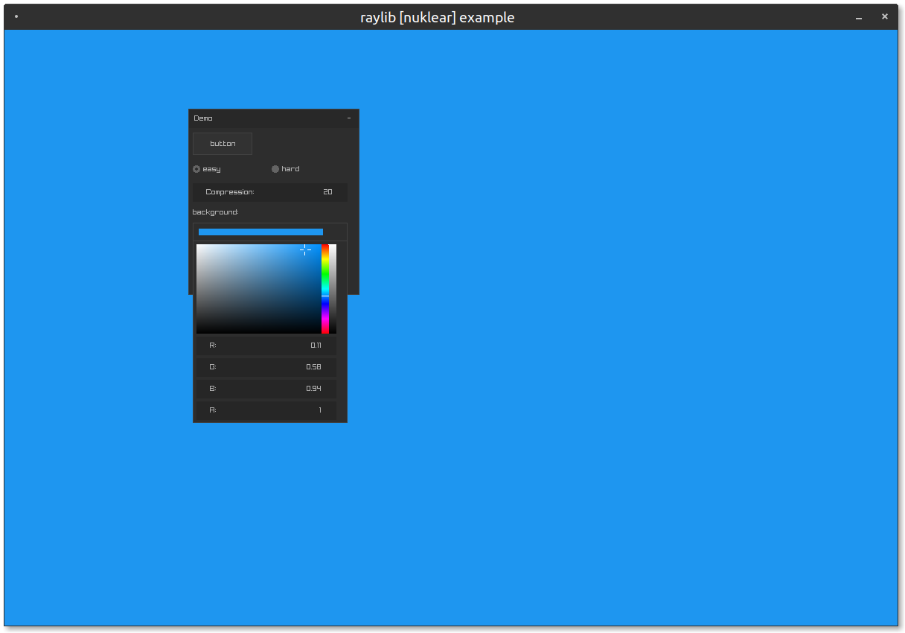

# raylib-nuklear

Use the [Nuklear](https://github.com/Immediate-Mode-UI/Nuklear) immediate mode cross-platform GUI library in [raylib](https://www.raylib.com/).

[](examples)

## Usage

1. Since this is a header-only library, you must first define `RAYLIB_NUKLEAR_IMPLEMENTATION` in one of your `.c` files...
    ``` c
    #define RAYLIB_NUKLEAR_IMPLEMENTATION
    ```
2. Include the [`raylib-nuklear.h`](include/raylib-nuklear.h) file...
    ``` c
    #include "path/to/raylib-nuklear.h"
    ```
3. Use `InitNuklear(fontSize)` or `InitNuklearEx(font, fontSize)` to create the nuklear context...
    ``` c
    struct nk_context *ctx = InitNuklear(10);
    ```
4. Build your Nuklear GUI through the standard [Nuklear API](https://github.com/Immediate-Mode-UI/Nuklear/wiki/Window)
5. Update the input for the GUI using `UpdateNuklear(ctx)`
6. Render the context using `DrawNuklear(ctx)`
7. Destroy the nuklear context with `UnloadNuklear(ctx)`

## Example

``` c
#define RAYLIB_NUKLEAR_IMPLEMENTATION
#include "raylib-nuklear.h"

int main() {
    InitWindow(640, 480, "raylib-nuklear example");

    // Create the Nuklear Context
    int fontSize = 10;
    struct nk_context *ctx = InitNuklear(fontSize);

    while (!WindowShouldClose()) {
        // Update the Nuklear context, along with input
        UpdateNuklear(ctx);

        // Nuklear GUI Code
        // https://github.com/Immediate-Mode-UI/Nuklear/wiki/Window
        if (nk_begin(ctx, "Nuklear", nk_rect(100, 100, 220, 220),
                NK_WINDOW_BORDER|NK_WINDOW_MOVABLE|NK_WINDOW_CLOSABLE)) {
            nk_layout_row_static(ctx, 50, 150, 1);
            if (nk_button_label(ctx, "Button")) {
                // Button was clicked!
            }
        }
        nk_end(ctx);

        // Render
        BeginDrawing();
            ClearBackground(RAYWHITE);

            // Render the Nuklear GUI
            DrawNuklear(ctx);

        EndDrawing();
    }

    // De-initialize the Nuklear GUI
    UnloadNuklear(ctx);

    CloseWindow();
    return 0;
}
```

## API

``` c
struct nk_context* InitNuklear(int fontSize);                // Initialize the Nuklear GUI context using raylib's font
struct nk_context* InitNuklearEx(Font font, float fontSize); // Initialize the Nuklear GUI context, with a custom font
Font LoadFontFromNuklear(int fontSize);                      // Loads the default Nuklear font
void UpdateNuklear(struct nk_context * ctx);                 // Update the input state and internal components for Nuklear
void UpdateNuklearEx(struct nk_context * ctx, float deltaTime); // Update the input state and internal components for Nuklear, with a custom frame time
void DrawNuklear(struct nk_context * ctx);                   // Render the Nuklear GUI on the screen
void UnloadNuklear(struct nk_context * ctx);                 // Deinitialize the Nuklear context
struct nk_color ColorToNuklear(Color color);                 // Convert a raylib Color to a Nuklear color object
struct nk_colorf ColorToNuklearF(Color color);               // Convert a raylib Color to a Nuklear floating color
struct Color ColorFromNuklear(struct nk_color color);        // Convert a Nuklear color to a raylib Color
struct Color ColorFromNuklearF(struct nk_colorf color);      // Convert a Nuklear floating color to a raylib Color
struct Rectangle RectangleFromNuklear(struct nk_context * ctx, struct nk_rect rect); // Convert a Nuklear rectangle to a raylib Rectangle
struct nk_rect RectangleToNuklear(struct nk_context * ctx, Rectangle rect); // Convert a raylib Rectangle to a Nuklear Rectangle
struct nk_image TextureToNuklear(Texture tex);               // Convert a raylib Texture to A Nuklear image
struct Texture TextureFromNuklear(struct nk_image img);      // Convert a Nuklear image to a raylib Texture
struct nk_image LoadNuklearImage(const char* path);          // Load a Nuklear image
void UnloadNuklearImage(struct nk_image img);                // Unload a Nuklear image. And free its data
void CleanupNuklearImage(struct nk_image img);               // Frees the data stored by the Nuklear image
void SetNuklearScaling(struct nk_context * ctx, float scaling); // Sets the scaling for the given Nuklear context
float GetNuklearScaling(struct nk_context * ctx);            // Retrieves the scaling of the given Nuklear context
```

See the [Nuklear API documenation](https://immediate-mode-ui.github.io/Nuklear/doc/nuklear.html) for more how to use Nuklear.

## Comparision

There are a few other graphical user interface solutions out there for use with raylib. [raygui](https://github.com/raysan5/raygui), [Nuklear](https://github.com/Immediate-Mode-UI/Nuklear), and [ImGui](https://github.com/ocornut/imgui) with [rlImGui](https://github.com/raylib-extras/rlImGui), are popular choices. It's best to choose the GUI that fits your needs best. Generally, if you're unsure which GUI to use with raylib, use [raygui](https://github.com/raysan5/raygui).

| | [Nuklear](https://github.com/Immediate-Mode-UI/Nuklear) | [raygui](https://github.com/raysan5/raygui) | [rlImGui](https://github.com/raylib-extras/rlImGui) |
| ----- |:-------:|:------:|:-----:|
| Only C | :white_check_mark: | :white_check_mark: | C++ |
| Minimal Dependencies |  :white_check_mark: |  :white_check_mark: | :x: |
| Automatic Layouts | :white_check_mark: | :x: | :white_check_mark: |
| Advanced Controls | :white_check_mark: | :x: | :white_check_mark: |
| Documentation | :white_check_mark: | :x: | :white_check_mark: |
| Industry Standard | :x: | :x: | :white_check_mark: |
| Easy to Use | :x: | :white_check_mark: | :x: |

## Development

While this project uses CMake, CMake is not required in order to use *raylib-nuklear*.

```
git submodule update --init
mkdir build
cd build
cmake ..
make
./example/raylib-nuklear-example
make test
```

## License

*raylib-nuklear* is licensed under an unmodified zlib/libpng license, which is an OSI-certified, BSD-like license that allows static linking with closed source software. Check [LICENSE](LICENSE) for further details.
